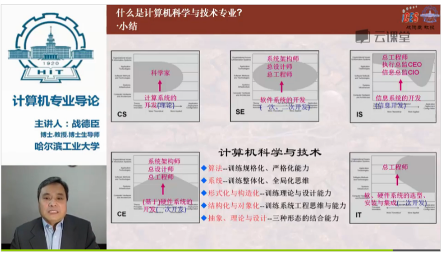

# Webservice

标签（空格分隔）： 未分类

---

WSDL:网络服务描述语言 webservice description language
UDDI:通用描述、发现与集成服务 universal description discovery and intergration
SOAP:simple object access protocal 基于XML的协议
SAAS:software as a service

- 计算机系统
- 计算机工程
- 软件工程
- 信息系统
- 信息技术

## CS-2013
### 内层核心课程
- 三大理论核心课程
计算机数学基础
计算机科学概率论
数据机构和算法
- 系统核心课程
编程方法和抽象
计算机组织和系统
### 中层核心课程
不同的方向：人工智能、理论、系统、同行、生物、物理。。。
计算机系统和网络

