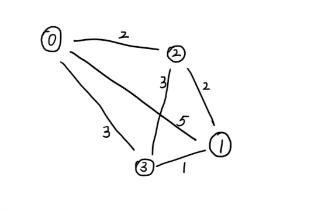

# TSP问题贪心算法

标签（空格分隔）： 未分类

---
## 问题描述
有n个城市，找出走遍所有城市的最短路径


- 定义数据结构
数组`int citys[]`保存所有的城市
二维数组 `int distans[][]`保存各个城市之间的距离
开始城市 `int start`
数组`int sortedCitys[]`最短路径的城市依次放入数组

- 算法实现过程
```c
//城市编号 0,1,2,3
int citys[4] = {};
//城市之间的距离 根据城市代号编码
|   |0  |1  |2  |3  |
————|————————————————
|0  |0  |4  |2  |3  |
|1  |4  |0  |2  |1  |
|2  |2  |2  |0  |3  |
|3  |3  |1  |3  |0  |
int distans = {{0,4,2,3},{4,0,2,1},{2,2,0,3},{3,1,3,0}};
//出发城市如从2号城市出发
int start = 2;
//将出发城市放入
sortedCitys[0] = start;
//大循环：从第一个城市开始找到距离最近的下一个城市
for(int i=0;i<4;i++){
    //如果第i个城市已经排好序了，找到距离它最近的城市
    for(int j=0;j<4;j++){
        //定义存放城市距离的变量 取一个大数用来比对找最小距离
        int mindis = 9999;
        int city = sortedCity[i];
        //如果比对的城市是当前城市 跳过
        if(city == j)
        break;
        int dis = distans[city][j];
        //确保当前比对的城市不在已经排好序的城市列表中
        for(int k=0;k<=i;k++){
            //如果已经在列表中 则跳过
            if(sortedCitys[k] == j){
                break;
            }else{
                if(dis < mindis){
                    mindis = dis;
                    //把当前城市加入到排序的城市中作为候选
                    sortedCity[i+1] = j;
                }
            }
        
        }
    }
}
```


